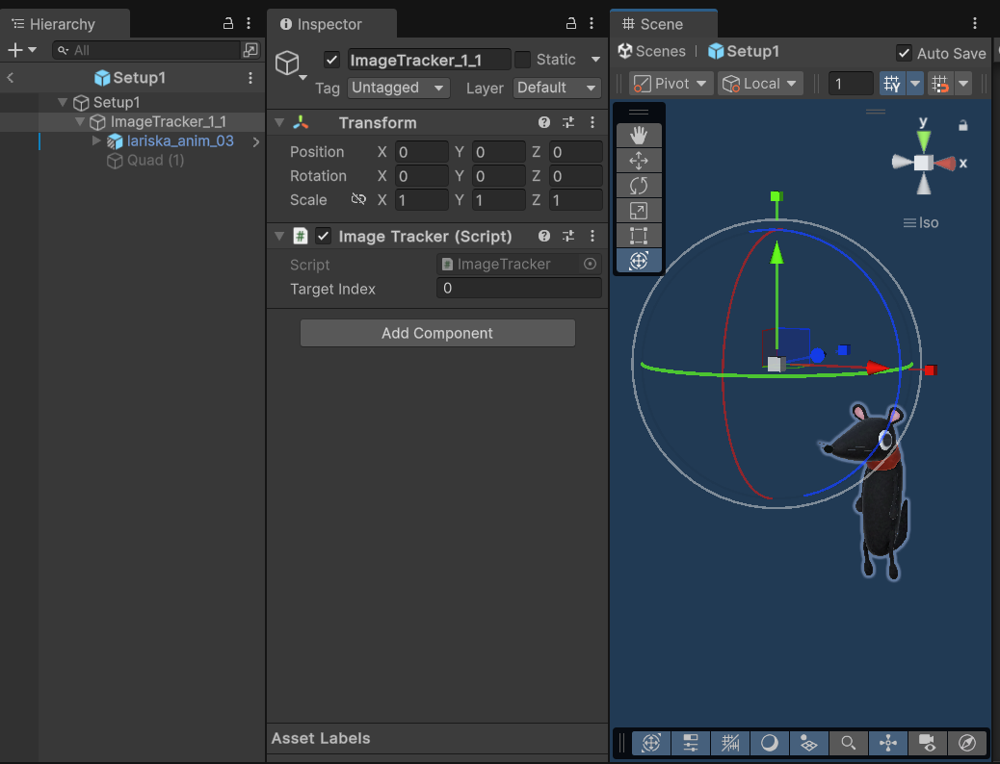
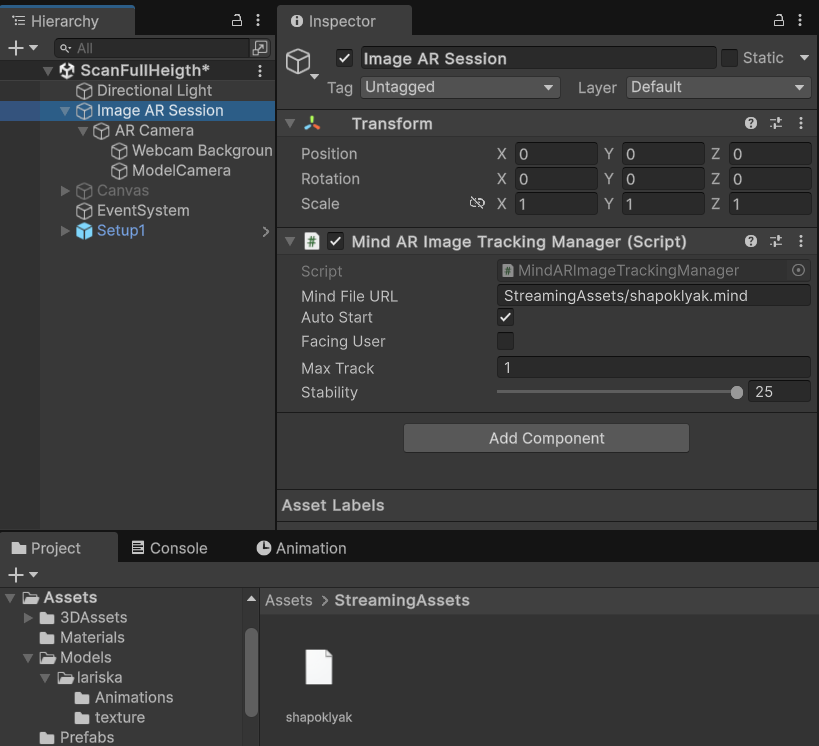

# SoyuzMult AR — Image Tracking (WebGL)

> Небольшое AR‑приложение на Unity + WebAR Foundation с трекингом по изображениям (MindAR) и билдом на GitHub Pages.

**🌐 Live demo:** <https://makaronnik13.github.io/SoyuzMult_Deploy/>

## 🎥 Демо‑видео
<video src="demo.MP4" controls autoplay muted loop style="max-width: 100%; border-radius: 8px;"></video>

---

## 💡 Использованные технологии
- Распознавание и трекинг меток — **WebAR Foundation** (Unity Asset Store):  
  <https://assetstore.unity.com/packages/tools/integration/webar-foundation-250806?srsltid=AfmBOoqUuEsSuylRsuAdvZXLafJiI4QMEBvqWQNR0IKL_ZUJGRkh211B>
- Компиляция маркеров **MindAR**: <https://hiukim.github.io/mind-ar-js-doc/tools/compile/>

---

## 🚀 Быстрый старт
1. Откройте сцену `ScanFullHeight` (или свою).
2. В корневом объекте **Image AR Session** на компоненте **MindARImageTrackingManager** укажите путь к файлу `.mind` (см. раздел ниже).
3. В под‑сцене/префабе (`Setup1`) разместите **ImageTracker** и поместите под него 3D‑модель, указав **Target Index** (ID цели внутри `.mind` файла).
4. Соберите WebGL‑билд и опубликуйте на GitHub Pages.

---

## 🖼️ Как сделать маркер (.mind) и подключить его

### 1) Скомпилировать .mind на сайте MindAR
1. Перейдите на страницу: <https://hiukim.github.io/mind-ar-js-doc/tools/compile/>
2. Загрузите изображение‑маркер (PNG/JPG, лучше с высоким контрастом и деталями).
3. Нажмите **Compile** и скачайте результат — файл `*.mind`.

### 2) Положить .mind в StreamingAssets
Поместите файл в проект по пути:
```
Assets/StreamingAssets/your_marker.mind
```

### 3) Указать путь в MindARImageTrackingManager
В инспекторе **Image AR Session** → **MindARImageTrackingManager** заполните поле **Mind File URL**:
```
StreamingAssets/your_marker.mind
```

<figure>
  
  <figcaption><b>Рис. 1.</b> Путь к .mind указывается относительно папки <code>StreamingAssets</code>.</figcaption>
</figure>

> Флаги **Auto Start**, **Max Track**, **Stability** — по задаче. Для одиночной метки достаточно `Max Track = 1`.

---

## 📌 Как привязать модель к конкретной метке (по ID)

Файл `.mind` может содержать несколько целей (targets). Каждая цель имеет индекс (ID), начиная с **0**.  
Чтобы показывать модель только при детекте конкретной цели:

1. В вашей сцене/префабе создайте объект **ImageTracker**.
2. В поле **Target Index** поставьте ID нужной цели (например, `0`).
3. Поместите 3D‑модель ребёнком под **ImageTracker** и подгоните позицию/масштаб/поворот.

<figure>
  
  <figcaption><b>Рис. 2.</b> Объект <code>ImageTracker</code> с <code>Target Index = 0</code>; модель — его дочерний объект.</figcaption>
</figure>

---

## 📝 Лицензия
MIT 

© 2025